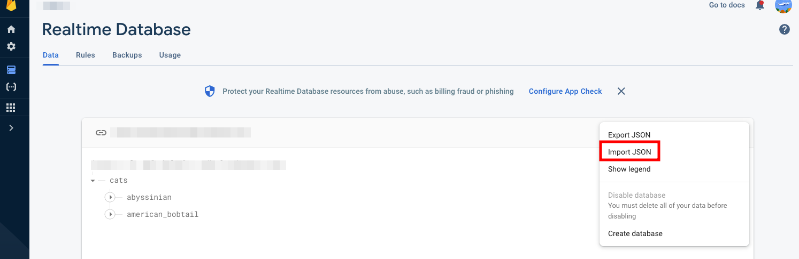

# Firebase Functions GraphQL Server
This is a implementation for creating [firebase functions](https://www.npmjs.com/package/firebase-functions) and accessing [realtime database](https://firebase.google.com/docs/database) with a [GraphQL](https://graphql.org/) Typescript server. 


> Notice: Firebase Functions is only accessible when you are under a [Blaze](https://firebase.google.com/pricing) (Pay as you go) plan. You also need to enable [Artifact Registry API](https://console.cloud.google.com/apis/api/artifactregistry.googleapis.com/metrics?project=fr-gql) in order to deploy this function.

## Prerequisite
Initial a new Firebase Functions through [Firebase CLI](https://firebase.google.com/docs/cli)
```bash
# Create a new project file, firebase init will not create for you.
mkdir new-app
cd new-app

firebase init

# Choose Functions by using space, hit enter key to confirm and wait it to be finished. Choose Typescript for this sample code.
```

## Usage
Copy the this repo root to your functions folder and 
```bash
git clone https://github.com/vincecao/firebase-functions-graphql-server.git
mv functions functions.bak
mv firebase-functions-graphql-server functions
cd functions
# install dependencies
yarn
```

## Modify Service Account Key and Database URL
By referring [database_environment.sample.json](./src/database_environment.sample.json), creating a `./src/database_environment.json` with your database URL and private service account key.

- `database_url` could be found in `Your Project => Settings => ServiceAccounts => AdminSDK`


- `account_key` could be found in this link: [https://console.cloud.google.com/iam-admin/serviceaccounts](https://console.cloud.google.com/iam-admin/serviceaccounts)


Below is an example structure.
```json
{
  "database_url": "https://xxxxx.firebaseio.com",
  "account_key": {
    "type": "service_account",
    "project_id": "xxxxx",
    "private_key_id": "xxxx",
    "private_key": "xxx",
    "client_email": "xx@appspot.gserviceaccount.com",
    "client_id": "xxx",
    "auth_uri": "https://accounts.google.com/o/oauth2/auth",
    "token_uri": "https://oauth2.googleapis.com/token",
    "auth_provider_x509_cert_url": "https://www.googleapis.com/oauth2/v1/certs",
    "client_x509_cert_url": "https://www.googleapis.com/robot/v1/metadata/x509/xxx%40appspot.gserviceaccount.com"
  }
}
```

## Have a try
Fill Sample JSON in realtime database first


```json
{
  "cats": {
    "abyssinian": {
      "description": "The Abyssinian is a breed of domestic short-haired cat with a distinctive \"ticked\" tabby coat, in which individual hairs are banded with different colors. They are also known simply as Abys. The breed is named for Abyssinia, where it is believed to have originated.",
      "lifespan": "14-15 years",
      "name": "Abyssinian"
    },
    "american_bobtail": {
      "description": "The American Bobtail is an uncommon breed of domestic cat which was developed in the late 1960s. It is most notable for its stubby \"bobbed\" tail about one-third to one-half the length of a normal cat's tail.",
      "lifespan": "13-18 years",
      "name": "American Bobtail"
    }
  }
}
```

Run a preview in local code environment. 

**Option 1**: `5000` is a default port for serve but MacOS using it for AirPlay. Thus, using port 5004 for preview script.

```bash
yarn preview:production
# yarn build && firebase serve -p 5004
```

**Option 2**: update `../firebase.json` in the parent folder for below and run `emulators`.
```json
"emulators": {
    "hosting": {
      "port": 5004
    }
  }
```

## Modify your own GraphQL type with realtime Database
Replacing `typeDefs` and `resolvers`.

## Deploy to Firebase
```bash
yarn deploy
```

# Reference
-  [GraphQL Server Using Firebase Functions](https://www.youtube.com/watch?v=I5irZ0AAr98)
- [How can i generate private key for firebase admin sdk?](https://stackoverflow.com/questions/72838290/how-can-i-generate-private-key-for-firebase-admin-sdk)
- [Firebase serve error: Port 5000 is not open. Could not start functions emulator](https://stackoverflow.com/questions/57537355/firebase-serve-error-port-5000-is-not-open-could-not-start-functions-emulator)
