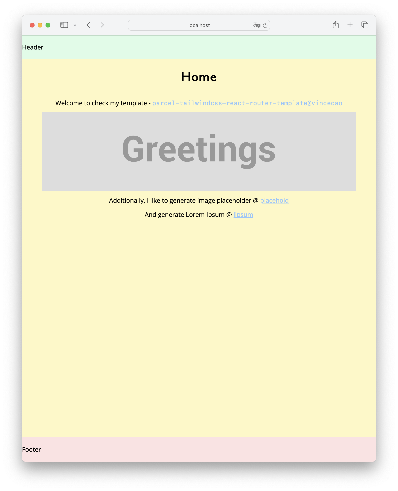

# Parcel + Tailwindcss + React-router

This is a simple template aiming for initializing project with [Parcel2](https://parceljs.org/), [Tailwindcss](https://tailwindcss.com/) and [react-router@6](https://reactrouter.com/en/main). The template only contains necessary structure suggestions and I hope it can make your life easier.

## Demo
Check the template [here](https://parcel-tailwindcss-react-router-template.vercel.app/)



## Development
```bash
yarn

yarn build
```

## Deployment
```
yarn

yarn build
```